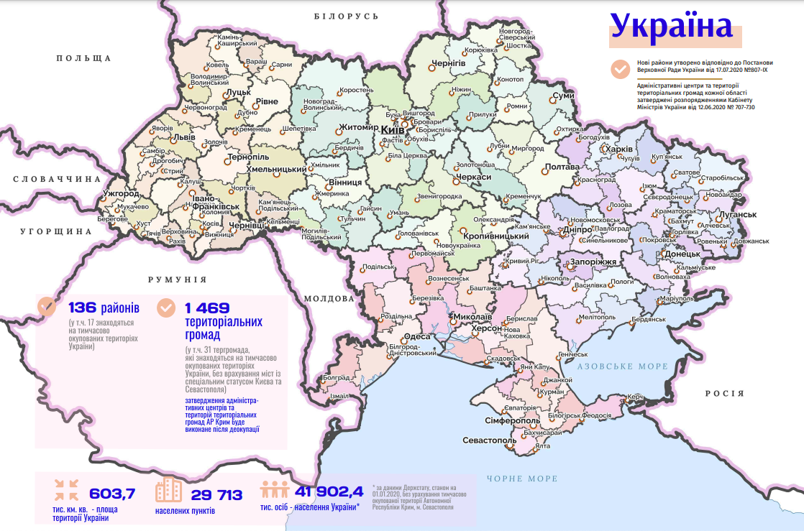
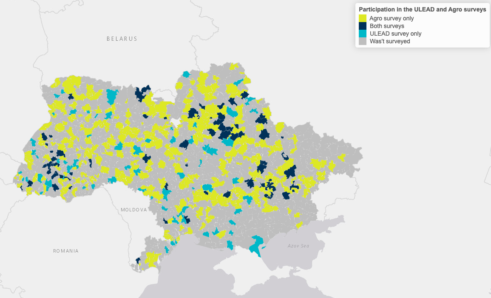

# Decentralization Reform in Ukraine (2014 -2022)


[](https://doi.org/10.5281/zenodo.15267573)


The project investigates the effects of restructurization of local councils (i.e. "rada", N = 11,250) into amalgamated territorial communities (i.e. "hromada", N = 1,469) and the effect of this tranformation on key macroeconomic and social indicators. Of specific interest is hromadas' **resiliance to full-scale russian invasion launched on 2022-02-24.**

This repository contains all the materials used to study the factors of resilience of Ukrainian communities in the context of the Russian invasion.

Another goal of the project is to create a repository of data available in Ukraine at the hromada level for further use in research and policy-making.

**👉 [⬇️ Download Main Data File (full_dataset.csv)](./data-public/derived/full_dataset.csv)**

The project is funded by GIZ within its project "Support to the Decentralisation Reform in Ukraine (UDU U-LEAD with Europe. Phase II) (#`81281025`)



*Source: The Atlas of Administrative and Territorial Division*

# Repository Structure

The repository has the following structure:

-   **data-public**:

    -   **data-public/raw**: a folder with initial data on hromadas obtained from open sources or through requests to government agencies

    -   **data-public/derived**: a folder with the final data that we received after processing the initial data with scripts (aggregation of data at the hromada level and calculation of new metrics)

-   **manipulation**: all the scripts which are used for data transformation of the raw data (the content of data-public/derived is a product of these scripts)

-   **analysis**: scripts for data analysis and data presentation within the project

-   **scripts**: useful functions for data wrangling/analysis

# Project Team

| Name              | Role                                                            | \@         |
|----------------|----------------------------------------|----------------|
| Tymofii Brik      | Lead Researcher                                                 |            |
| Andriy Darkovich  | Research Assistant                                              |            |
| Valentyn Hatsko   | Data Analyst                                                    | valgat29   |
| Andriy Koval      | Reproducible Research                                           | andkov     |
| Maryna Rabinovych | Senior Researcher                                               |            |
| Myroslava Savisko | Project Manager                                                 | splanetina |
| Serhii Tytiuk     | Data Analyst                                                    | tytser     |
| Igor Piddubniy    | Data Analyst                                                    | ipiddubnyi |

# Project Products

## Surveys

The Kyiv School of Economics (KSE) Institute conducted two surveys of hromadas in 2022 to study the impact of Russia's full-scale invasion on their economic performance and to identify factors of hromada resilience to various types of war-related shocks. The datasets of surveys results are nor available on the repository due to the sensitivity of some data.

<table>
<thead>
<tr class="header">
<th><p></p></th>
<th><p>Survey #1</p></th>
<th><p>Survey #2</p></th>
</tr>
</thead>
<tbody>
<tr class="odd">
<td><p><strong>Lead center</strong></p></td>
<td><p>KSE Agrocenter</p></td>
<td><p>KSE Center for Sociological Research Decentralization<br />
and Regional Development</p></td>
</tr>
<tr class="even">
<td><p><strong>Target audience</strong></p></td>
<td><p>Local authorities of hromadas</p></td>
<td><p>Local authorities of hromadas</p></td>
</tr>
<tr class="odd">
<td><p><strong>Survey mode</strong></p></td>
<td><p>Web survey</p></td>
<td><p>Web survey</p></td>
</tr>
<tr class="even">
<td><p><strong>Sample size</strong></p></td>
<td><p>477 hromadas</p></td>
<td><p>138 hromadas</p></td>
</tr>
<tr class="odd">
<td><p><strong>Fieldwork dates</strong></p></td>
<td><p>June-August 2022</p></td>
<td><p>October-November 2022</p></td>
</tr>
</tbody>
</table>

### **Map of hromadas participated in the surveys**



## Reports

-   [Resilience Survey overview](https://raw.githack.com/kse-ua/ua-de-center/main/analysis/survey-overview/survey-overview-hatsko.html) - Results and Key findings of the Resiliance Survey

-   [Hromada Dashboard](https://valentyn-hatsko.shinyapps.io/hromada-dash/) - Dashboard with Data on Territorial Communities

-   [Share of military PIT in total community revenues in 2021 and 2022](https://raw.githack.com/kse-ua/ua-de-center/main/publications/vox/map_pct_military.html) - Map of change in share of military PIT from VoxUkraine column

## Articles

-   VoxUkraine. [What makes territorial communities resilient – the first lessons after February 24](https://voxukraine.org/en/what-makes-territorial-communities-resilient-the-first-lessons-after-february-24)

-   VoxUkraine. [A year of experience: Governance processes and the territorial communities’ (hromadas’) resilience to wartime challenges](https://voxukraine.org/en/a-year-of-experience-governance-processes-and-the-territorial-communities-resilience-to-wartime-challenges)

- VoxUkraine. [«Військовий» ПДФО: як може змінитися система спрямування податку та до чого це призведе](https://voxukraine.org/vijskovyj-pdfo-yak-mozhe-zminytysya-systema-spryamuvannya-podatku-ta-do-chogo-tse-pryzvede)

## Data Products

| Data Product Name                      | Description                                                                                                                                                                                                                                                                                                                                                                                            | Current State / Left To Do                                                                               | Script                                        |
|-------------|---------------------------------|-------------|-------------|
| Admininstrative Units                  | Relationship among multiple administrative levels (settlement, rada, hromada, raion, oblast, region)                                                                                                                                                                                                                                                                                                   | ready for analysis at `./data-public/derived/ua-admin-map-2020.csv`                                      | `./manipulation/ellis-ua-admin.R`             |
| Admin History                          | Composition of hromadas (what radas comprise it) at every point in time when such composition changed, from 2014 to 2020                                                                                                                                                                                                                                                                               | push to ./data-public/derived/                                                                           | `./manipulation/ellis-rada-hromada.R`         |
| Population                             | Population counts at the level of hromada (2021 only)                                                                                                                                                                                                                                                                                                                                                  | Add more years (currently only 2021), push to ./data-public/derived/                                     | `./manipulation/ellis-demography.R`           |
| Open Budget                            | Tax revenues of admin units                                                                                                                                                                                                                                                                                                                                                                            | No clarity yet. Classify hromadas based on complexity of their admin history                             | `./manipulation/ellis-budget.R`               |
| Open Budget                            | Tax revenues of hromadas 2020-2022                                                                                                                                                                                                                                                                                                                                                                     | ready for analysis at `./data-public/derived/hromada_budget_2020_2022.xlsx`                              | `./manipulation/ellis-budget-2020-2022.R`     |
| Financial Capacity                            | Financial Capacity Assessment of Territorial Communities                                                                                                                                                                                                                                                                                                                                                                     | ready for analysis at `./data-public/derived/fin_capacity_merged.xlsx`                              | ``     |
| Geographic                             | Main spatial features of hromadas: area, coordinates of hromada center, travel time to oblast center, mountain hromadas, distance from hromada centers to the nearest point of the border with Russia, Russia or Belarus, or the EU; hromadas within 30 km of the sea/30 km of the border/30 km of the border with Russia and Belarus; hromadas within 15 km of international roads and national roads | ready for analysis at `./data-public/derived/geography.csv`                                              | `./manipulation/ellis-geography.R`            |
| Geographic                             | Spatial poligons of hromadas                                                                                                                                                                                                                                                                                                                                                                           | Demonstate graphing maps (at hromada-raion-oblast level) using a replacable quantifier (e.g. population) |                                               |
| Community Competence                   | Number of youth centers, youth councils and centers for entrepreneurial support (2021 only)                                                                                                                                                                                                                                                                                                            | ready for analysis at `./data-public/derived/community-competence-hromada.csv`                           | `./manipulation/ellis-community-competence.R` |
| Health Declarations                    | Number of declarations with health facilities as of February 2022                                                                                                                                                                                                                                                                                                                                      | ready for analysis at `./data-public/derived/declarations-hromada.csv`                                   | `./manipulation/ellis-health.R`               |
| OSBB (Homeowners Associations)         | Number of homeowners associations in 2015-2020                                                                                                                                                                                                                                                                                                                                                         | ready for analysis at `./data-public/derived/osbb-hromada.csv`                                           | `./manipulation/ellis-health.R`               |
| Passengers                             | Number of passengers arriving at hromada railway stations in 2021                                                                                                                                                                                                                                                                                                                                      | push to ./data-public/derived/                                                                           | `./manipulation/ellis-osbb.R`                 |
| ZNO (External Independent Examination) | Mean scores of ZNO (standardized test) for main subjects                                                                                                                                                                                                                                                                                                                                               | Add more years (currently only 2021), push to ./data-public/derived/                                     | `./manipulation/ellis-zno.R`                  |
| War zones                              | Statuses of the war zone/occupation according to the Ministry of Regional Development                                                                                                                                                                                                                                                                                                                  | push to ./data-public/derived                                                                            | `./manipulation/ellis-war-status.R`           |
| E-dem                                  | Form of electronic participation in hromadas                                                                                                                                                                                                                                                                                                                                                           | push to ./data-public/derived                                                                            | `./manipulation/ellis-edem.R`                 |
| DFRR                                   | Data on cost of the projects financed by the State Regional Development Fund                                                                                                                                                                                                                                                                                                                           | ready for analysis                                                                                       | `./manipulation/ellis-dfrr.R`                 |

# How To Contribute to Repository

You can contribute using [Git](https://docs.github.com/en/get-started/quickstart/set-up-git) or other [GUI tools](https://github.com/firstcontributions/first-contributions/blob/main/README.md#tutorials-using-other-tools) (_more convenient option_).

## Fork this repository


Fork this repository by clicking on the fork button on the top of this page. This will create a copy of this repository in your account.

## Clone the repository

Now clone the forked repository to your machine. Go to your GitHub account, open the forked repository, click on the code button and then click the copy to clipboard icon.
Open a terminal and run the following git command:

```
git clone https://github.com/kse-ua/KSE-Loc-Data-Hub.git
```
where "https://github.com/kse-ua/KSE-Loc-Data-Hub.git" (without the quotation marks) is the url to this repository (your fork of this project). See the previous steps to obtain the url.


For example:

```
git clone git@github.com:your-name/KSE-Loc-Data-Hub.git
```

where your-name is your GitHub username. Here you're copying the contents of the KSE-Loc-Data-Hub repository on GitHub to your computer.

## Create a branch

Change to the repository directory on your computer (if you are not already there):

```
cd KSE-Loc-Data-Hub
```
Now create a branch using the git switch command:

```
git switch -c your-new-branch-name
```
For example:

```
git switch -c add-new-dataset
```

## Make changes and commit those changes

To make a commit to this project, follow these steps:

1. Make the necessary changes to the dataset, whether it's updating existing data or adding new data.

2. Save the dataset with your changes.

3. If you're adding a completely new dataset to the repository, place the dataset in the appropriate directory within the project.

4. To see the changes, navigate to the project directory in your terminal or command prompt and execute the command `git status` to see the changes.

5. Use the following command to add the changes to your branch if you modified an existing dataset:
   
   ```
   git add your-dataset-filename
   ```
   
   Replace `your-dataset-filename` with the name of the dataset you modified.

6. If you're adding a completely new dataset, use the following command to add all new and modified files:
   ```
   git add .
   ```

7. Commit the changes with a descriptive message using the following command:
   
   ```
   git commit -m "Add/Update data in your-dataset-filename"
   ```
   Be sure to replace `your-dataset-filename` with the name of the dataset you worked on.

## Push changes to GitHub

Push your changes using the command git push:

```
git push -u origin your-branch-name
```

replacing your-branch-name with the name of the branch you created earlier.

## Submit your changes for review

To submit your changes for review:

Go to your repository on GitHub and locate the "Compare & Pull Request" button. Click on this button to start the process.


Create a pull request, and as part of this request, provide a detailed comment that outlines the changes you've made, their significance, and any context that might be helpful for the reviewers. A clear and informative comment is crucial for a successful review.


After you've submitted your pull request, our team will review the changes you've proposed. 

If your changes align with the project's goals and meet the necessary criteria, they will be merged into the main branch.

You will receive a notification email once your changes have been successfully merged into the project.
